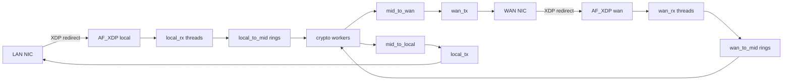

# network-encryptor (ne_mac_learn)

Daemon mã hóa lưu lượng giữa **LAN** và **WAN** bằng **XDP + AF_XDP (libxdp/libbpf)**. Cấu hình từ **PostgreSQL**, hỗ trợ **PQC handshake** và **MAC learning** để forward L2 theo iface đã học.

Entry point: [`main.c`](main.c).

## Cấu trúc thư mục

| Path | Vai trò |
|------|---------|
| [`main.c`](main.c) | Daemon: LISTEN `xdp_start`, CLI (`-gi`, `-id`, `-check`, …) |
| [`bpf/`](bpf/) | XDP programs: [`lan.c`](bpf/lan.c), [`wan.c`](bpf/wan.c) → `lib/*.o` |
| [`src/core/`](src/core/) | Dataplane, forwarder, interface, MAC learn, profile XDP |
| [`src/crypto/`](src/crypto/) | AES/GCM layers L2–L4, PQC handshake/IPC |
| [`src/db/`](src/db/) | Load config từ Postgres |
| [`inc/`](inc/) | Headers (`core/`, `crypto/`, `db/`) |
| [`include/`](include/) | Vendored libbpf/libxdp headers |
| [`schema.sql`](schema.sql) | Schema: `ne_profiles`, `ne_lan`/`ne_wan`, policies, PQC keys |
| [`sh/`](sh/), [`systemd/`](systemd/) | Deploy, init DB, systemd unit |
| [`tools/`](tools/) | Benchmark/test GCM fragment |

## Build & chạy

```bash
make          # → network-encryptor + lib/lan.o + lib/wan.o
```

Dependencies: **libxdp, libbpf, libelf, zlib, pthread, OpenSSL, libpq, libscrypt**, clang (BPF), `pg_config`.

Modes chính:

- Daemon (không arg): `LISTEN xdp_start` trên Postgres
- `-id <profile_id>`: notify daemon apply config đã lưu trong DB
- `-gi` / `-check-identity`: tạo / kiểm tra identity PQC
- `-check [ID]`: kiểm tra tính nhất quán config DB
- `-r <policy_id>`: retry handshake thủ công

## Luồng dữ liệu



- **XDP LAN** ([`bpf/lan.c`](bpf/lan.c)): ARP pass; IPv4 → `xsks_map` theo `rx_queue_index`.
- **XDP WAN** ([`bpf/wan.c`](bpf/wan.c)): ARP pass; IP (ICMP/TCP/UDP/OSPF/custom) hoặc fake ethertype từ `wan_config_map` → `wan_xsks_map`.
- User-space: shared UMEM (`ne_pair`), multi-queue XSK, ring buffers giữa RX / crypto / TX ([`inc/core/interface.h`](inc/core/interface.h), [`inc/core/forwarder.h`](inc/core/forwarder.h)).

## Module chính

- **Interface / dataplane** — [`src/core/interface.c`](src/core/interface.c): UMEM, XSK open, plumb/unplumb local/WAN, RX/TX, frame pool.
- **Forwarder** — [`src/core/forwarder.c`](src/core/forwarder.c) + wan/reload/crypto_runtime: khởi tạo threads, stop/reload.
- **MAC learn** — [`src/core/mac_learn.c`](src/core/mac_learn.c): bảng 256 entry, hash theo `mac[5]`, TTL 5 phút; `mac_learn` / `mac_lookup` trên `struct forwarder`.
- **Crypto** — layer2/3/4, fragment, flow_table, PQC handshake + IPC.
- **DB** — [`schema.sql`](schema.sql) + `src/db/*`: profile → LAN/WAN ifaces, policies, tunnels, PQC keys.
- **Profile XDP** — [`src/core/profile_iface_xdp.c`](src/core/profile_iface_xdp.c): attach/detach XDP, reload ADD/REMOVE/DELTA.
- **Profile iface lifecycle** — [`src/core/profile_iface_lifecycle.c`](src/core/profile_iface_lifecycle.c): attach/detach LAN/WAN rows, allocate slot, rollback; gọi từ XDP reload path. Plumb API: `ne_pair_plumb_*` / `ne_pair_unplumb_*`, `local_live` / `wan_live` trong [`inc/core/interface.h`](inc/core/interface.h).

## Điểm vào khi đọc code

1. [`main.c`](main.c) — lifecycle daemon + NOTIFY
2. [`src/core/forwarder.c`](src/core/forwarder.c) — pipeline threads
3. [`src/core/interface.c`](src/core/interface.c) — XSK/UMEM
4. [`src/core/profile_iface_xdp.c`](src/core/profile_iface_xdp.c) + lifecycle — hot-add/remove iface theo profile
5. [`src/core/mac_learn.c`](src/core/mac_learn.c) — L2 learn/lookup
